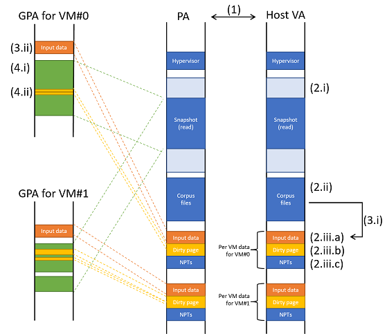

# rhv
A fuzzing hypervisor for UEFI on Intel/AMD processors.

- [rhv](#rhv)
  - [Overview](#overview)
    - [Startup](#startup)
    - [Fuzzing Iteration](#fuzzing-iteration)
  - [Design](#design)
    - [Snapshot](#snapshot)
    - [Patch](#patch)
    - [Corpus](#corpus)
    - [Coverage tracking](#coverage-tracking)
    - [Memory management](#memory-management)
    - [Catching Bugs](#catching-bugs)
  - [Limitations](#limitations)


## Overview
This section explains how this hypervisor gets executed and performs fuzzing.


### Startup
A user executes the `rhv.efi` on the UEFI shell.
```text
fs0> rhv.efi snapshot.img snapshot_patch.json corpus
```
The UEFI shell is a shell for UEFI environment where your code can take over almost all computer resources for your task. This is beneficial for fuzzing as we want to maximize its performance, instead of resources taken by OS and other processes.

During start up of rhv, it loads a snapshot file (ie, `snapshot.img` above) and sets up a VM based on it for each logical processor on the system. Think of this as KVM or VMware starting a VM from a snapshot. This VM is where fuzzing target code is executed. For efficiency, the snapshot should be taken right before target logic starts parsing input data (eg, an image file).

Before starting the VM, rhv will modify part of VM's memory and registers to inject input (fuzzy) data to fuzz target logic. This data is generated from the corpus files (ie, `corpus` directory above) and mutation logic.


### Fuzzing Iteration
Once input data is injected and mutated, rhv starts the VM, letting target logic run against the input data.

VM's execution is preempted by rhv on certain events (ie, when VM exit occurs). The followings are the primary causes of it:
1. The VM attempts to access memory that is not "paged-in" from the snapshot (nested page fault)
2. The VM causes #BP exception
3. The VM causes #UD exception

On those events, rhv gets resumed and handles the event as below:
- (1) is handled by reading captured memory from the snapshot file (ie, paging-in) and letting the VM retry the same instruction. When "paging-in" memory from the snapshot file, contents may be modified according to a patch file (ie, `snapshot_patch.json` above). If the VM attempts to access memory not captured in the snapshot file, rhv aborts the VM and may report it as a possible indicator of a bug.
- (2) can happen because of the patch mentioned above. The patch may place the `INT3` instruction at the beginning of every basic block in a target file, and execution of it by the VM causes VM exit. This is treated as new coverage as it means a new basic block is executed. rhv removes `INT3` and resumes the VM.
- (3) can happen because of the patch as well. The patch may place the `UD` instruction at the end of the fuzzing target function, and execution of it by the VM causes VM exit. This is treated as completion of execution of target logic. The VM is aborted, and rhv moves to the next iteration.

When the VM is aborted, rhv reverts all guest's registers and dirty memory to the initial state and repeats the same process with further mutated input data.

A VM is created for each logical processor and performs the above fuzzing iteration concurrently, utilizing full processor resources for fuzzing.


## Design
This section details core concepts and designs to understand how this hypervisor works.


### Snapshot
The hypervisor takes a file containing copy of physical memory and various register values through the first command line parameter. This file is referred to as a snapshot file. The hypervisor sets up a VM according to the contents of this file.

To make the fuzzing process efficient, the snapshot file should be created right before a system executes a fuzzing target function. This way, when the hypervisor creates and starts the VM, the VM immediately starts executing the target function without wasting time.

The contents of the snapshot starts with copy of physical memory and ends with a 4KB of metadata containing register values. Hence, if the snapshot is taken on a system with 512MB of physical memory, the snapshot file size is 512MB + 4KB.

The sample snapshot was taken by a custom hypervisor that is not included in the project. The author intend to publish it.

The snapshot taken on an Intel system should be usable on an AMD system, and vice versa.


### Patch
The hypervisor takes a file containing a list of addresses and byte-sequences to write to the addresses through the 2nd command line parameter. This file is referred to as a patch file. The hypervisor applies those patches when it reads a page from the snapshot file.

The patches are used for two purposes:
1. Coverage measurement
2. Aborting a fuzzing iteration quickly

For 1, the `INT3` instruction is placed at the beginning of each basic block within a target module to track code coverage. More details are explained in the "Coverage tracking" section below.

For 2, the `UD` instruction is placed at a return address of a fuzzing target function. This triggers #UD when a guest completes execution of a target function and causes VM exit. The hypervisor aborts the guest and moves onto a new fuzzing iteration, preventing unnecessary code to be executed. This patch is created manually.


### Corpus
The hypervisor takes a directory containing files to be used as initial input data through the 3rd command line parameter. Those files are read in memory and referred to as corpus.

At runtime, the hypervisor assigns one of the input files from the corpus for each VM. For each fuzzing iteration, the hypervisor modifies the input file according to the mutation strategy (see `Cargo.toml`). If modified input added new coverage, the modified input is considered to be good and added to the corpus in memory, allowing further modification.

The default mutation strategy is sequential single bit-flipping, meaning the bit position 0 of an input file is negated (eg, 0 -> 1 or 1 -> 0) for the first iteration. The 2nd iteration restores the previous change and performs the same for the bit position 1. This process is repeated until it reaches the last bit in the input file. Once the series of bit flipping completes, the hypervisor assigns a new input file from the corpus.


### Coverage tracking
Basic-block edge coverage is tracked by the hypervisor.

Using the patch file, the beginning of each basic block of the target module is patched with the `INT3` instruction. When a guest executes a basic block, #BP is raised, which is intercepted as VM exit. The hypervisor records this VM exit as new coverage, reverts the `INT3` instruction with an original byte, and lets the guest continue. This one-time VM exit allows the hypervisor to track code coverage with a minimal performance impact. Such patches are generated with IDA Pro and `ida_generate_patch.py`.

When new coverage is added, it is reported on the log as `COVERAGE:` followed by an address of the basic block. This coverage information can be visualized on IDA Pro with `ida_highlight_coverage.py`.


### Memory management
There are at least 2 "views" of memory: what the hypervisor sees, and what a VM sees. The following diagram illustrates those views, where the former is denoted as "Host VA", and the latter is "GPA for VM#n".

1. During the UEFI phase where the hypervisor runs, physical memory is identity-mapped (meaning a physical address 0x1000 always backs virtual address 0x1000, for example). Hence, memory layouts of physical memory and host virtual memory are identical.
2. On startup, the hypervisor allocates:
   1. a block of memory large enough to store the entire contents of a snapshot file. This block remains empty at this point.
   2. a block of memory storing all contents of corpus files. This block is read-only after this point.
   3. blocks of memory for the following for each logical processor:
      1. input data pages
      2. dirty pages
      3. empty nested paging structures and other HW VT related data structures
3. At the beginning of a fuzzing iteration, the hypervisor
   1. copies one of corpus files (2.ii) to the input data pages (2.iii.a) and/or mutates it.
   2. maps the input data pages (2.iii.a) into the guest memory and changes guest registers to make the guest use that region as input data
4. During a fuzzing iteration, where memory access by the guest is translated through nested paging:
   1. when a guest attempts to access any memory, the hypervisor updates nested paging structures (2.iii.c) to map the memory to the snapshot file (2.i) as read-only, by reading 4KB each time.
   2. when a guest attempts to modify read-only memory, the hypervisor updates nested paging structures (2.iii.c) to map it to a dirty page (2.iii.b), isolating effect of memory change in the current guest
5. At the end of a fuzzing iteration,
   1. the hypervisor restores nested paging structures (2.iii.c) updated for write access (4.ii), effectively reverting all memory modification from the guest perspective


### Catching Bugs
Possible indicators of bugs discovered during a fuzzing session are reported with `WARN:` messages in the log. The below lists a few types of indicators and how the hypervisor catches them:
- Invalid memory access -> #PF interception and nested page fault
- Use of a non-canonical form memory address -> #GP interception
- Valid but bogus code execution -> #UD and #BP interception
- Dead loop -> Timer expiration

Since the author has not discovered non-dead-loop bugs with the sample snapshot, exploration of those ideas is left as an exercise for readers.


## Limitations
The hypervisor is written specifically to explain foundation of virtualization technology and be functional with the sample snapshot file. Thus, its ability is limited and is unlikely usable for your use cases as-is.

Said this, those are major limitations to highlight:
- No guest (snapshot) that uses paging -- the hypervisor assumes a guest runs under identity mapping. This means that only a snapshot taken at a pre-boot (UEFI) phase is usable.
- No multi-processor support for Bochs and VMware -- such configuration results in dead loop. This is because their UEFI implementations do not allow an application processor calling some of UEFI services within the callback function of `startup_all_aps`.
