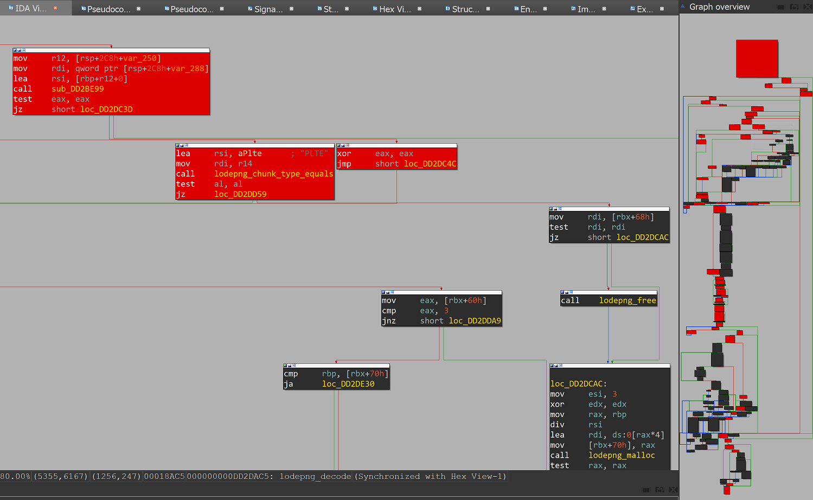

# Test Files
This directory contains multiple files for testing. For building, installing and running Bochs, see [BUILDING.md](../BUILDING.md).


## IDA Python Files
`ida_generate_patch.py` is to generate a patch file for coverage tracking for a given IDB file. It enumerates all basic blocks and generates break point patches for those locations.

`ida_highlight_coverage.py` is to highlight basic blocks that were executed by a fuzzing session. To use this script, run a fuzzing session and specify its serial log file as input of this script. `ida_reset_highlight.py` is to reset highlighting.

For `refind_x64_signed_at_0xDD15000.efi`, the image needs to be rebased onto 0xDD15000 on IDA before running those scripts.




## samples.7z
This file contains the following demo target and input files and is automatically unzipped on test run as needed:
- `corpus` -- 3 identical PNG input files.
- `snapshot.img` -- the sample snapshot file.
- `snapshot_patch_empty.json` -- the sample empty patch file.
- `snapshot_patch_end_marker.json` -- the sample patch file containing the end marker patch.
- `snapshot_patch.json` -- the sample patch file containing containing both the end marker and break point patches.
- `bochs_disk.img` -- the bochs disk file, containing all of the below.
- `refind_x64_signed_at_0xDD15000.efi` - the signed [rEFInd Boot Manager](https://www.rodsbooks.com/refind/) contained in `snapshot.img`.
- `vmware` -- A set of files for testing with VMware.

The snapshot is taken when rEFInd, a custom UEFI boot manager, is about to parse image data. This UEFI program has a plenty of image and config parsers and is signed. Thus, RCE would result in Secure Boot bypass through crafted image files, for example.

The bochs disk file was created with the following commands:
```shell
bximage -q -func=create -hd=2G bochs_disk.img
mkfs.vfat bochs_disk.img
mcopy -i bochs_disk.img corpus ::
mcopy -i bochs_disk.img snapshot_patch_empty.json ::
mcopy -i bochs_disk.img snapshot_patch_end_marker.json ::
mcopy -i bochs_disk.img snapshot_patch.json ::
mcopy -i bochs_disk.img snapshot.img ::
```

The VMware disk file `vmware\NoOS.vmdk` contains the same files as `bochs_disk.img`.


## startup.nsh
This file specifies commands to be automatically executed on the UEFI shell. This file is copied into a VM on each test run to automate part of test operations.
